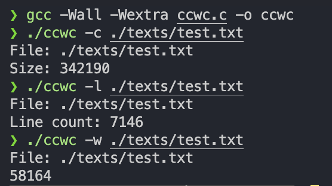

# WC Tool

## Description
This project is an implementation of the Unix command line tool `wc` (word count). It follows the Unix Philosophies of writing simple parts connected by clean interfaces, where each tool does one thing and provides a simple CLI that handles text input from either files or file streams.

## Current Features
The ccwc supports the following command-line options:

`-c`: Outputs the number of bytes in the file.

`-l`: Outputs the number of lines in the file.

`-w`: Outputs the number of words in the file.

## How to Run
Compile - `gcc -Wall -Wextra ccwc.c -o ccwc`

Run - `./ccwc {flag} pathtofile`

## Future Improvements

- Add more comman-line options:
    - `-m`: Outputs the number of characters in the file (accounting for multi-byte characters).
    - No options (default): Outputs the number of lines, words, and bytes in the file.
- Handle buffer overunrs
- Ensure there are enough arguments before accessing argv[2].
- Provide clear usage instructions if arguments are missing or invalid.
- Add support for multiple input files.
- Optimize performance for very large input files.
- Read from standard input if no filename is specified
## Links Used

[Compare Arguments](https://stackoverflow.com/questions/27525617/how-to-properly-compare-command-line-arguments#:~:text=To%20compare%20strings%2C%20you%20need%20to%20use%20strcmp()%20.&text=if%20you%20want%20to%20check,%22%2Ds%22%20or%20not.&text=Compare%20the%20two%20strings%20using,(s1%2Cs2)%20function.&text=if%20you%20check%20the%20argv,condition%20will%20not%20be%20true.)

[File Size 1](https://stackoverflow.com/questions/48063652/how-can-i-get-a-files-size-in-c-without-using-either-fseek-or-stat)

[File Size 2](https://ccodelearner.com/c-examples/find-size-of-file/#:~:text=Finding%20the%20Size,-Once%20we%20have&text=In%20C%2C%20we%20can%20use%20the%20fseek()%20and%20ftell,the%20next%20operation%20will%20occur.)

[Line Count 1](https://stackoverflow.com/questions/12733105/c-function-that-counts-lines-in-file)

[Line Count 2](https://www.youtube.com/watch?v=AAF207cxbXk)

[Line Count 3](https://codeforwin.org/c-programming/c-program-count-characters-words-lines-in-file)

[Word Count 1](https://www.javatpoint.com/program-to-find-the-number-of-words-in-the-given-text-file)

[Word Count 2](https://stackoverflow.com/questions/7374062/how-do-i-count-the-number-of-words-in-a-text-file-using-c)